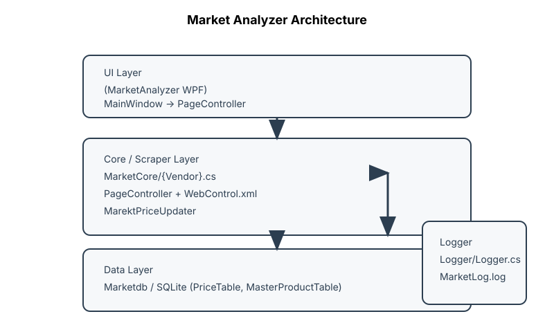

# Architecture Overview

This repository is organized as a multi-project Visual Studio solution. The core goal is to scrape product pricing information from multiple e-commerce vendors and store the results in a local SQLite database.

## 🧱 Core Layers

### 1) UI Layer (`MarketAnalyzer/`)
- **`MainWindow.xaml` + `MainWindow.xaml.cs`**: Provides a simple WPF UI with checkboxes for each vendor and a textbox for a custom URL.
- Uses `PageController` (from `MarketCore`) to orchestrate scraping operations.
- Supports optional multi-threading via `Thread` objects to run each vendor scraper in parallel.

### 2) Application Logic / Scraping Layer (`MarketCore/`)
- **`PageController`**: Primary orchestrator that:
  - Reads `MasterProductTable` from the local database.
  - Chooses the correct vendor scraper based on the vendor name.
  - Runs the vendor scraper for each master product.

- **Vendor scraper classes (e.g., `Amazon.cs`, `BestBuy.cs`, `WallMart.cs`, etc.)**
  - Each vendor class uses Selenium WebDriver (ChromeDriver) to perform a search and scrape results.
  - Each class reads its CSS/XPath selectors from `WebControl.xml` via `MarketCoreControlReader`.
  - Scraped results are inserted into the database via `MarektPriceUpdater`.

- **`MarketCoreControlReader`**
  - Reads `MarketCore/WebControl.xml` and provides selector values (search box IDs, result element CSS selectors, etc.).

- **`MarektPriceUpdater`**
  - Writes scraping results into the SQLite `PriceTable` and `MasterProductTable`.
  - Performs basic string cleanup on scraped prices.

### 3) Data Layer (`Marketdb/`)
- Contains `MarketDatabaseOperations`, a simple SQLite helper that:
  - Creates `MarketDataBaseFile.sqlite` and tables if not already present.
  - Executes raw SQL commands and returns a `DataTable`.

- Schema (created by default constructor):
  - `MasterProductTable(productid INTEGER PRIMARY KEY, MasterProductName string)`
  - `PriceTable(id INTEGER PRIMARY KEY, vendorid string, productid string, productname string, price string, sellerranking string)`
  - `VendorTable(id INTEGER PRIMARY KEY, VendorName string)` (never used by other code currently)

### 4) Logging (`Logger/`)
- Contains `Logger.Logger`: a minimal file logger that appends timestamped messages to `MarketLog.log`.

---

## 🔌 External Dependencies

- **Selenium WebDriver** (WebDriver & WebDriver.Support)
- **ChromeDriver** (invoked as `new ChromeDriver()`)
- **SQLite** (via `System.Data.SQLite`)
- **Entity Framework 6** (referenced in `Marketdb`, but not actively used by the current code)

---

## 📌 How the Scraper Works (End-to-end)

1. **User selects vendors in the UI** and clicks the run button.
2. `MainWindow` creates one or more `PageController` instances.
3. `PageController.creatingProduct()` reads the `MasterProductTable` items from the database.
4. For each vendor, `PageController` instantiates the appropriate vendor scraper class.
5. The vendor scraper:
   - Loads `WebControl.xml` for its vendor.
   - Opens Chrome and navigates to the vendor website.
   - Enters the master product name into the search box.
   - Scrapes the first result's name and price.
   - Persists the scraped price into `PriceTable`.
6. Results can be reviewed by examining the SQLite file (`MarketDataBaseFile.sqlite`).

---

## 🧠 Key Design Concepts

- **Selector-driven scraping**: All vendor-specific selectors are stored in an XML file (`WebControl.xml`) to avoid hard-coding selectors inside the scraping logic.
- **Master product list**: The database contains a master list of product names to search across vendors.
- **Per-vendor scraping classes** are mostly independent; they share the same structure, but each contains vendor-specific XPath/CSS logic and result parsing.

---

## 🧩 Where To Look First

If you want to understand or extend the core scraping behavior:

- `MarketCore/PageController.cs` — orchestrator + vendor router
- `MarketCore/MarketCoreControlReader.cs` — loads selectors
- `MarketCore/<Vendor>.cs` — individual scrapers
- `MarketCore/WebControl.xml` — selector configuration

If you want to understand data persistence:

- `Marketdb/Class1.cs` (aka `MarketDatabaseOperations`)
- `MarketCore/MarektPriceUpdater.cs` (writes to `PriceTable`)
